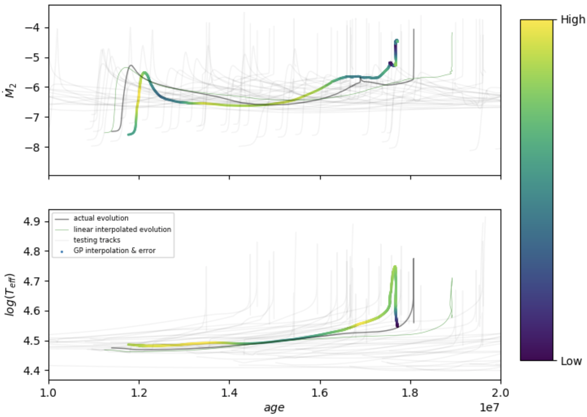
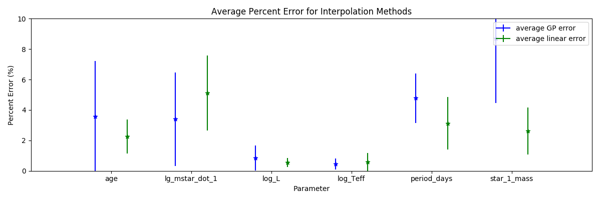

# Predicting Stellar Evolution with Gaussian Process Regression
## Final Report

### Motivation

The evolution of stars is fundamental to many areas of astrophysics, ranging from the formation of planets to evolution of the universe as a whole. 
Simulating the evolution of stars, in particular large populations of stars, is paramount for properly understanding a diverse range of astrophysical processes. 
However, accurately simulating stellar evolution is difficult and computationally expensive, especially when simulating stars that are interacting with one another in a binary system. 
Binary stars are in fact more common than isolated stars, and lead to important transient astrophysical phenomena, such as the merging of black holes, X-ray binary systems, and certain types of supernovae. 
Simulating a dense enough grid of such systems is computationally unfeasible, and the ability to accurately interpolate stellar evolution would be a critical advancement in the study of stellar populations. 

### Methods

In this project, we use Gaussian Process Regression (GPR) to predict the evolution of various physical parameters in binary stellar evolution sequences, such as the temperature of the stars, brightness of the stars, and the rate at which one star transfers mass to another as a funtion of time. 
To train our model, we use a grid of ~1000 simulations of a star transferring mass to a compaion black hole. 
Each simulation is defined by the following initial conditions (i.e. inputs):
- Star mass
- Black hole mass
- Orbital separation
- Metallicity (i.e. the abundance of elements heavier than Helium)

These initial conditions map to a few dozen time dependent outputs, such as the star's luminosity and temperature, the rate at which mass is being transferred from the star to the black hole, and the evolution of the system's orbit. 
We train a GPR model and predict the evolution of systems at points in our 4-dimensional input space at which simulations were not performed. 
In addition to providing interpolated evolutionary sequences, GPR also predicted the uncertainty at any point in our input space. 
This not only allows us to predict the evolution of unsimulated systems, but also allows us to target regions of parameter space where it would be best to spend computational resources to simulate new systems, thereby improving the overall accuracy of our model. 

### Results

*Interpolated evolution of a binary system. 
The top plot shows the mass transfer rate as a function of the system's age, and the bottom plot shows the (log) effective temperature as a function of system. 
The colored line, green line, and black line show the GPR interpolation, a linear interpolation, and the true evolution of one of the sequences in our validation set. 
The shaded lines show the evolution of various systems in our training set. 
The color scale indicates the amount of uncertainty predicted by GPR at each point along the sequence.*

To assess the quality of our interpolations, we perform 10-fold cross-validation and calculate the average mean-squared error (MSE) of our interpolations for various output parameters. 
We find errors that are generally as low as a few percent. 
The initial conditions of our simulations (i.e. our input feature) all drastically affect the evolution of the binary systems, and were all important for accurate interpolation. 
Our method also predicts the areas of parameter space with the highest interpolation uncertainty. 
These regions will be targeted with future simulations and once finished will be added to our training set
This will thereby improving the accuracy of our model, and we can continue this process iteratively to build a highly accurate and rapid means for predicting the evolution of stellar systems. 

*Mean-squared error (MSE) for various output parameters, averaged over the 10 cross-validation subsamples.
The output parameters, from left to right, are the system age, the (log) mass transfer rate from the star to the black hole, the (log) luminosity of the star, the (log) effective temperature of the star, the orbital period of the system, and the mass of the star.
Blue shows the GPR MSE error, whereas green shows the linear interpolation MSE error.
Error bars show one standard deviation across the different validation sets in 10-fold cross-validation.*
