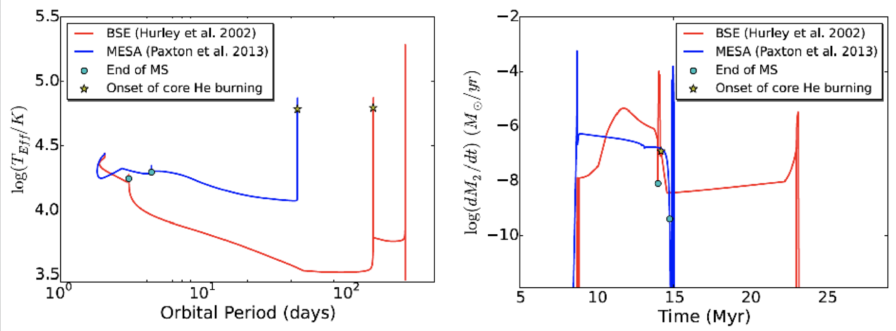
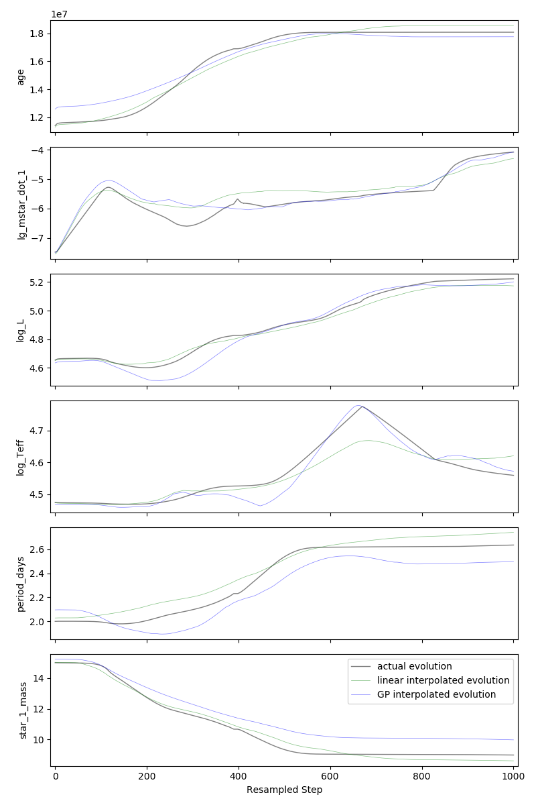

# Predicting Stellar Evolution with Gaussian Process Regression
## Final Report

The evolution of stars is fundamental to many areas of astrophysics, ranging from the formation of planets to evolution of the universe as a whole. 
To better understand such evolutionary processes, the astronomy community relies on population modeling — simulating the evolution of many stars with varying initial conditions.
However, current codes struggle with population modeling either because of coarse approximations or computational constraints. 
As these models rely heavily on multiple initial conditions, creating a dense grid of high resolution simulations is impracticable when dealing with this multidimensional input spaces.
The current practice is to utilize rapid synthesis codes that approximate stellar evolution with fitting formulae of single undisturbed stars in thermal equilibrium as opposed to high-resolution and expensive codes that directly evolve the differential equations that govern stellar evolution. 
However, this compromise can cause a drastic loss in accuracy, especially when simulating binary systems (two stars in orbit around each other) with complicated physical processes that can drive stars out of thermal equilibrium (see Figure 1). 
These inaccuracies propagate to the final population models, thereby affecting their parameter distributions and hindering our ability to predict the formation rates and properties of compact object systems.

*Figure 1. Example evolution of the same system using a high-resolution simulation (MESA) compared to a rapid fitting-formula based simulation (BSE).
Symbols denote different critical points in the evolution of the binary star system.
The MESA simulation can be considered the "ground truth", and clearly the rapid simulation does not do well at approximating the true evolution of this system.*

This adverse trade-off between speed and accuracy may be ameliorated with advanced machine learning techniques.
In this project, we use Gaussian Process Regression (GPR) to predict the evolution of various physical parameters in binary stellar evolution sequences, such as the temperature of the stars, brightness of the stars, and the rate at which one star transfers mass to another as a funtion of time. 
To train our model, we use a grid of ~1200 high-resolution simulations of a star transferring mass to a compaion black hole. 
Each simulation is defined by the following properties: the initial mass of the star and the black hole, the initial orbital separation, and the metallicity of the star ((i.e. the abundance of elements heavier than Helium).
These initial conditions map to a few dozen time-dependent outputs, such as the star's luminosity and temperature, the rate at which mass is being transferred from the star to the black hole, and the evolution of the system's orbit. 
For a set of initial conditions x, we will therefore aim predict arrays of time-dependent outputs f(x).

We pre-process that data in multiple different ways. 
First of all, the output of simulations are not all the same length, as different systems require more or less "steps" in the simulation depending on the complexity of the evolution. 
We must therefore resample all the simulations so that there are the same number of steps for each evolutionary sequence. 
One naive option for resampling would be to resample evenly in the age of the system, such that each simulation has N "timesteps". 
However, during the evolution of these types of systems, drastic changes in one parameter (for example, the size of the star) can occur over very short periods of time, and resampling based on the age of the system will not accurately capture this chaotic evolution. 
We therefore perform a multi-dimensional resampling -- taking equal steps along a hyperline in N-dimensional output space. 
Furthermore, after performing this resampling we also perform principal component analysis (PCA) on the outputs, and interpolate between these principal components rather than the individual steps in the output parameter. 
We maintain the first 5 principal components, as these components alone appear to do a good job at describing the evolution of the outputs. 
After interpolation, we do an inverse transformation to project the interpolated outputs back into a physical basis. 

We use the [Scikit-Learn Gaussian process implementation](http://scikit-learn.org/stable/modules/generated/sklearn.gaussian_process.GaussianProcessRegressor.html) for this project. 
We use a squared exponential kernel, and optimize the hyperparameters of the kernel using maximum likelihood methods. 
To assess the quality of our model we then do 10-fold cross-validation, for each fold training our GPR model on 90% of the sequences in our grid and validating our interpolation with the remaining 10%. 
A GPR model is created for each output parameter individually. 
In addition, we also perform a simple linear interpolation to compare with the GPR. 
Figures 2 and 3 show example 1-parameter and 2-parameter interpolations, respectively. 

*Interpolated evolution of various parameters for a binary system. 
The plots, from top to bottom, show the interpolation for the system's age (since steps in the simulation are adaptive, age is also an output parameter), the (log) mass transfer rate from the star to the black hole, the (log) of the luminosity of the star, the (log) of the effective temperature of the star, the orbital period, and the mass of the star versus resampled step.
Black lines indicate the true evolution, blue lines the GPR, and green lines the linear interpolation.*

*Interpolated evolution of a binary system, where both the x-axis and y-axis parameters are interpolated.
The top plot shows the mass transfer rate as a function of the system's age, and the bottom plot shows the (log) effective temperature as a function of system. 
The colored line, green line, and black line show the GPR interpolation, a linear interpolation, and the true evolution of one of the sequences in our validation set. 
The shaded lines show the evolution of various systems in our training set. 
The color scale indicates the amount of uncertainty predicted by GPR at each point along the sequence.
This plot is analagous to Figure 1 above but for interpolated systems.*

We calculate the average mean-squared error (MSE) for various output parameters to assess the overall quality of our interpolations.
As can be seen in Figure 4, across the board we find errors that are generally as low as a few percent. 
The initial conditions of our simulations (i.e. our input feature) all drastically affect the evolution of the binary systems, and were all important for accurate interpolation. 
Though linear interpolation MSE scores seems to be on par with GPR, Gaussian processes also predict the areas of parameter space with the highest interpolation uncertainty. 
These regions will be targeted with future simulations and once finished will be added to our training set. 
This will hopefully improving the accuracy of our model, and we can continue this process iteratively to build a highly accurate and rapid means for predicting the evolution of stellar systems. 
Furthermore, future experiments will adjust the kernel and kernel hyperparameters to try and increase the performance of the GPR. 

*Mean-squared error (MSE) for various output parameters, averaged over the 10 cross-validation subsamples.
The output parameters, from left to right, are the system age, the (log) mass transfer rate from the star to the black hole, the (log) luminosity of the star, the (log) effective temperature of the star, the orbital period of the system, and the mass of the star.
Blue shows the GPR MSE error, whereas green shows the linear interpolation MSE error.
Error bars indicate one standard deviation across the different validation sets in 10-fold cross-validation.*
